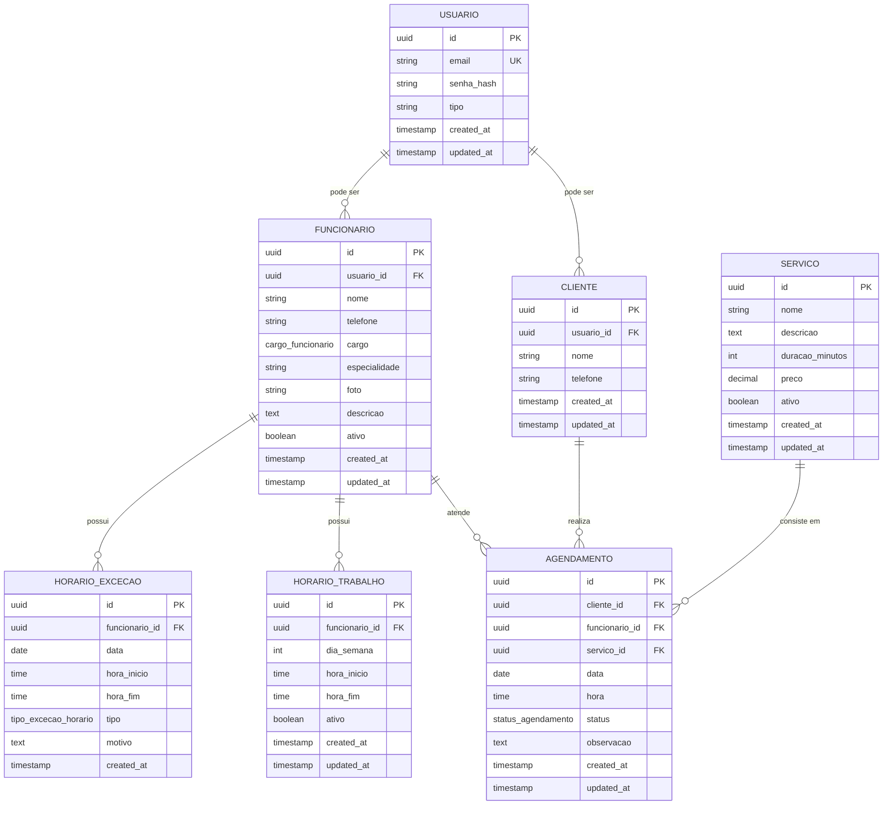

# Diagrama ER — Modelo de Banco de Dados (Implementado)

> Fonte: `backend/migrations/**` (modelo real implementado).
> Este diagrama reflete o modelo **atual do repositório**, que evoluiu além da Seção 21 original.
> A Seção 21 do documento funcional foi atualizada para refletir este modelo.

## Diagrama Mermaid

## Resumo das Tabelas

| Tabela             | Campos                                                                                                                              |
|--------------------|-------------------------------------------------------------------------------------------------------------------------------------|
| USUARIO            | id (PK, uuid), email (UK), senha_hash, tipo, created_at, updated_at                                                                |
| CLIENTE            | id (PK), usuario_id (FK→USUARIO), nome, telefone, created_at, updated_at                                                           |
| FUNCIONARIO        | id (PK), usuario_id (FK→USUARIO), nome, telefone, cargo (enum), especialidade, foto, descricao, ativo, created_at, updated_at      |
| SERVICO            | id (PK), nome, descricao, duracao_minutos, preco (DECIMAL 10,2), ativo, created_at, updated_at                                     |
| HORARIO_TRABALHO   | id (PK), funcionario_id (FK→FUNCIONARIO), dia_semana, hora_inicio, hora_fim, ativo, created_at, updated_at                         |
| HORARIO_EXCECAO    | id (PK), funcionario_id (FK→FUNCIONARIO), data, hora_inicio, hora_fim, tipo (enum), motivo, created_at                             |
| AGENDAMENTO        | id (PK), cliente_id (FK→CLIENTE), funcionario_id (FK→FUNCIONARIO), servico_id (FK→SERVICO), data, hora, status (enum), observacao, created_at, updated_at |

## Enums

| Enum                    | Valores                                        |
|-------------------------|------------------------------------------------|
| `cargo_funcionario`     | `barbeiro`, `recepcionista`, `administrador`   |
| `tipo_excecao_horario`  | `bloqueio`, `liberacao`                        |
| `status_agendamento`    | `pendente`, `confirmado`, `cancelado`, `concluido` |

## Relacionamentos (1:N)

| Origem          | Cardinalidade | Destino           | Descrição                          |
|-----------------|---------------|-------------------|------------------------------------|
| USUARIO         | 1 → N         | CLIENTE           | Um usuário pode ser cliente        |
| USUARIO         | 1 → N         | FUNCIONARIO       | Um usuário pode ser funcionário    |
| CLIENTE         | 1 → N         | AGENDAMENTO       | Um cliente realiza agendamentos    |
| FUNCIONARIO     | 1 → N         | AGENDAMENTO       | Um funcionário atende agendamentos |
| SERVICO         | 1 → N         | AGENDAMENTO       | Um serviço compõe agendamentos     |
| FUNCIONARIO     | 1 → N         | HORARIO_TRABALHO  | Um funcionário possui horários     |
| FUNCIONARIO     | 1 → N         | HORARIO_EXCECAO   | Um funcionário possui exceções     |

## Constraints e Índices

| Tabela           | Constraint / Índice                                    |
|------------------|--------------------------------------------------------|
| USUARIO          | email UNIQUE                                           |
| CLIENTE          | usuario_id UNIQUE, FK→USUARIO (CASCADE)                |
| FUNCIONARIO      | usuario_id UNIQUE, FK→USUARIO (CASCADE), idx cargo     |
| HORARIO_TRABALHO | UNIQUE(funcionario_id, dia_semana), CHECK(hora_fim > hora_inicio) |
| HORARIO_EXCECAO  | CHECK(hora_fim > hora_inicio), idx(funcionario_id, data) |
| AGENDAMENTO      | idx(funcionario_id, data, hora), idx(cliente_id, data) |

## Notas de Evolução

Este modelo substitui a modelagem inicial da Seção 21 original, que previa 5 tabelas (`usuario`, `barbeiro`, `servico`, `agendamento`, `horario`). O modelo implementado:

- **Separa `cliente` e `funcionario`** em tabelas próprias (em vez de apenas campo `tipo` em `usuario`), pois cada papel possui atributos específicos.
- **Substitui `barbeiro` por `funcionario`** com campo `cargo` (enum: barbeiro, recepcionista, administrador), unificando os papéis de equipe.
- **Divide `horario` em `horario_trabalho`** (recorrente por dia da semana) e **`horario_excecao`** (bloqueios/liberações pontuais).
- **Usa `uuid`** como chave primária (via `gen_random_uuid()`).
- **Armazena senha como `senha_hash`** (nunca texto puro).
- **Usa enums** para cargos, tipo de exceção e status de agendamento.
- **Usa `DECIMAL(10,2)`** para preço (nunca float).
- **Usa `duracao_minutos`** (INT) para duração de serviço.
