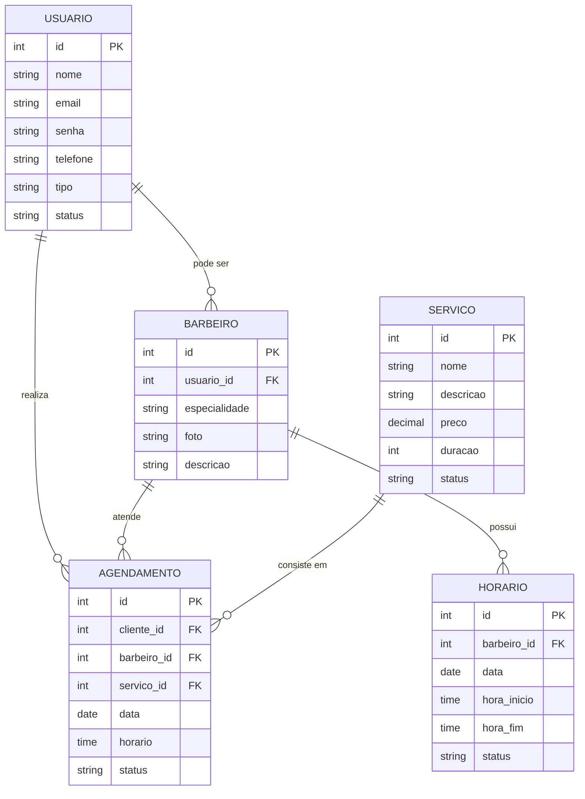

# Diagrama ER — Modelagem Inicial do Banco de Dados

> Fonte: `docs/documentacao_spa_barbearia_MVP.md`, Seção 21.
> Diagrama gerado sem alterar o modelo original.
> Decisões aplicadas conforme recomendação do arquiteto-banco-dados.

## Diagrama Mermaid

## Resumo das Tabelas

| Tabela        | Campos                                                                                   |
|---------------|------------------------------------------------------------------------------------------|
| USUARIO       | id, nome, email, senha, telefone, tipo, status                                          |
| BARBEIRO      | id, usuario_id (FK→USUARIO), especialidade, foto, descricao                             |
| SERVICO       | id, nome, descricao, preco, duracao, status                                              |
| AGENDAMENTO   | id, cliente_id (FK→USUARIO), barbeiro_id (FK→BARBEIRO), servico_id (FK→SERVICO), data, horario, status |
| HORARIO       | id, barbeiro_id (FK→BARBEIRO), data, hora_inicio, hora_fim, status                      |

## Relacionamentos (1:N)

| Origem     | Cardinalidade | Destino      | Descrição                      |
|------------|---------------|--------------|--------------------------------|
| USUARIO    | 1 → N         | BARBEIRO     | Um usuário pode ser barbeiro   |
| USUARIO    | 1 → N         | AGENDAMENTO  | Um usuário realiza agendamentos|
| BARBEIRO   | 1 → N         | AGENDAMENTO  | Um barbeiro atende agendamentos|
| SERVICO    | 1 → N         | AGENDAMENTO  | Um serviço compõe agendamentos |
| BARBEIRO   | 1 → N         | HORARIO      | Um barbeiro possui horários    |

## Decisões Aplicadas

### 1. `cliente_id` em AGENDAMENTO → referencia USUARIO

`cliente_id` referencia `USUARIO.id` diretamente. O campo `tipo` em USUARIO identifica o papel (CLIENTE, BARBEIRO, RECEPCIONISTA, ADMINISTRADOR). Não há tabela CLIENTE separada.

**Justificativa:**
- USUARIO é a entidade base com todos os dados pessoais
- Criar tabela CLIENTE separaria dados duplicados (nome, email, telefone)
- BARBEIRO tem tabela própria por possuir atributos específicos (especialidade, foto, descricao)
- O backend filtra por `tipo = 'cliente'` quando necessário

### 2. Convenção de Tipos de Dados

| Campo | Tipo | Observação |
|-------|------|------------|
| `id` | `INT` (auto-increment) | PK padrão |
| `nome`, `email`, `senha`, `telefone` | `VARCHAR(255)` | Email com UNIQUE |
| `tipo`, `status` | `VARCHAR(50)` | Valores controlados |
| `especialidade`, `foto`, `descricao` | `TEXT` | Conteúdo variável |
| `preco` | `DECIMAL(10,2)` | Nunca float para dinheiro |
| `duracao` | `INT` | Em minutos |
| `data` | `DATE` | |
| `horario`, `hora_inicio`, `hora_fim` | `TIME` | |

**Justificativa:**
- `DECIMAL` para preço evita erros de ponto flutuante binário
- `VARCHAR(255)` é suficiente para nomes e emails
- `TEXT` para campos com conteúdo variável
- `INT` para duração facilita cálculos

### 3. Recepcionista e Administrador → valores do campo `tipo`

Recepcionista e Administrador são valores do campo `tipo` em USUARIO, sem tabela separada.

**Justificativa:**
- Não possuem atributos adicionais além dos campos de USUARIO
- A seção 21 mostra que USUARIO pode ser CLIENTE, BARBEIRO, RECEPCIONISTA ou ADMINISTRADOR — são papéis, não entidades distintas
- Criar tabelas separadas seria over-engineering
- O controle de acesso é feito pelo backend usando o campo `tipo`

## Pendências Registradas

_Nenhuma pendência aberta. Decisões aplicadas conforme recomendações acima._
