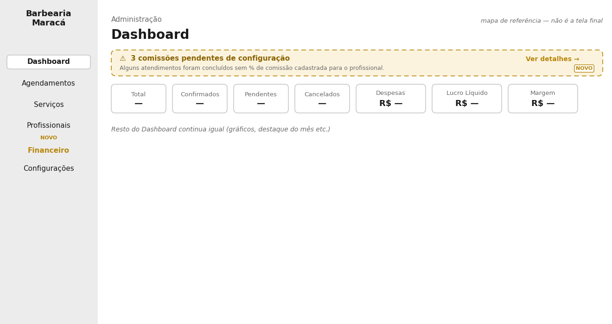
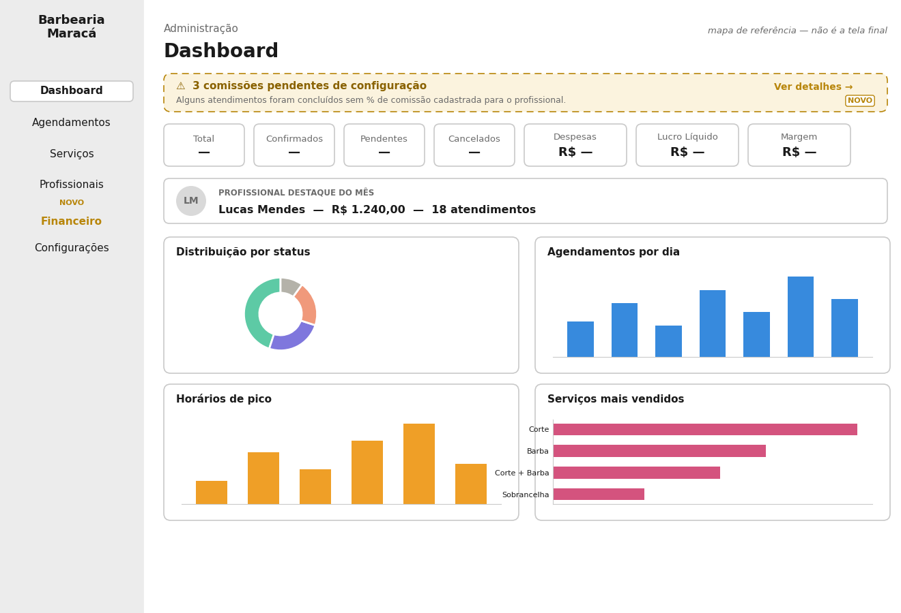
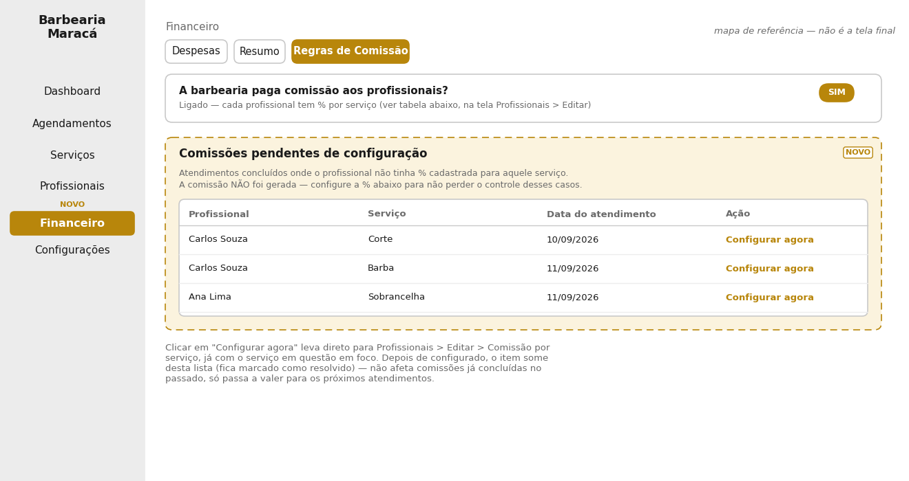
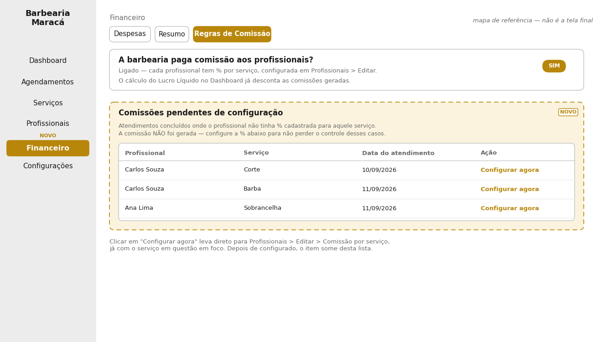

# Aviso de "Comissão pendente de configuração" — onde entra no layout

Complemento a `especificacao-financeiro-comissao.md` (seção 3.4/3.5) e a
`especificacao-painel-barbeiro.md`. Trata de UM caso de borda: o que aparece
na tela quando um atendimento é concluído e o profissional não tinha % de
comissão cadastrada para aquele serviço.

**Decisão de negócio:** o atendimento sempre conclui normalmente (nunca
trava por causa disso). Mas o sistema registra o caso e avisa o admin em
dois lugares, que se complementam. Cada seção abaixo traz duas imagens: só
o elemento novo em destaque, e a tela inteira (existente + novo) para
contexto completo.

## 1. Dashboard — banner de aviso no topo

**Só o elemento novo:**

**Tela completa (existente + novo, no lugar real):**

Aparece **só quando existe pelo menos 1 pendência**. Se não houver nenhuma,
o banner não é exibido (não ocupa espaço à toa). Clicar em "Ver detalhes"
leva direto para a seção 2, abaixo.

## 2. Financeiro › Regras de Comissão — lista de pendências

**Só o elemento novo:**

**Tela completa (existente + novo, no lugar real):**

## 3. Navegação — sem modal, em nenhuma etapa

- Clicar em **"Ver detalhes"** (no banner do Dashboard) → **navega** para a
  aba Financeiro › Regras de Comissão (troca de tela normal, mesma lógica de
  clicar em um item do menu lateral). Não abre modal.
- Clicar em **"Configurar agora"** (numa linha da lista de pendências) →
  **navega** para Profissionais › Editar daquele profissional específico, já
  aberto na seção "Comissão por serviço". Também não abre modal.

Motivo de não usar modal: a ação de "Configurar agora" leva para uma tela
diferente da lista de pendências. Se "Ver detalhes" abrisse um modal, e
dentro dele "Configurar agora" precisasse navegar para outra tela, teríamos
modal-dentro-de-modal ou a necessidade de fechar o modal para navegar — um
padrão de UX a evitar. Fluxo simples, só navegação normal entre telas que já
existem no sistema.

Uma tabela nova dentro da mesma tela onde o admin já liga/desliga a comissão
e configura as %. Cada linha mostra: profissional, serviço, data do
atendimento, e um botão "Configurar agora" que leva direto para
Profissionais › Editar › Comissão por serviço, já com o serviço em questão
em foco.

**Comportamento ao resolver:** depois que o admin cadastra a % daquele
profissional para aquele serviço, o item some da lista (fica marcado como
resolvido). Isso não gera retroativamente a comissão do atendimento que já
passou — só vale a partir dos próximos atendimentos daquele par
profissional/serviço.

## Resumo para quem vai implementar o visual

- Contagem no banner do Dashboard = quantidade de itens não resolvidos na
  lista de Regras de Comissão (mesma fonte de dado, dois lugares de
  exibição).
- Cor de aviso (âmbar/dourado), não vermelho de erro — não é uma falha do
  sistema, é uma pendência administrativa comum, sem gravidade que impeça o
  uso normal do sistema.
- Cada linha da lista é individual (um par profissional+serviço), não
  agrupada por profissional — um profissional pode aparecer várias vezes se
  tiver mais de um serviço sem % configurada.
