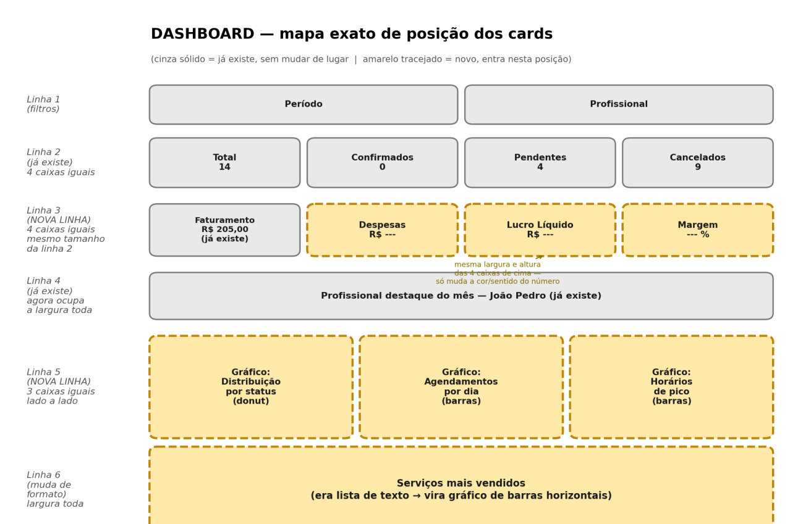
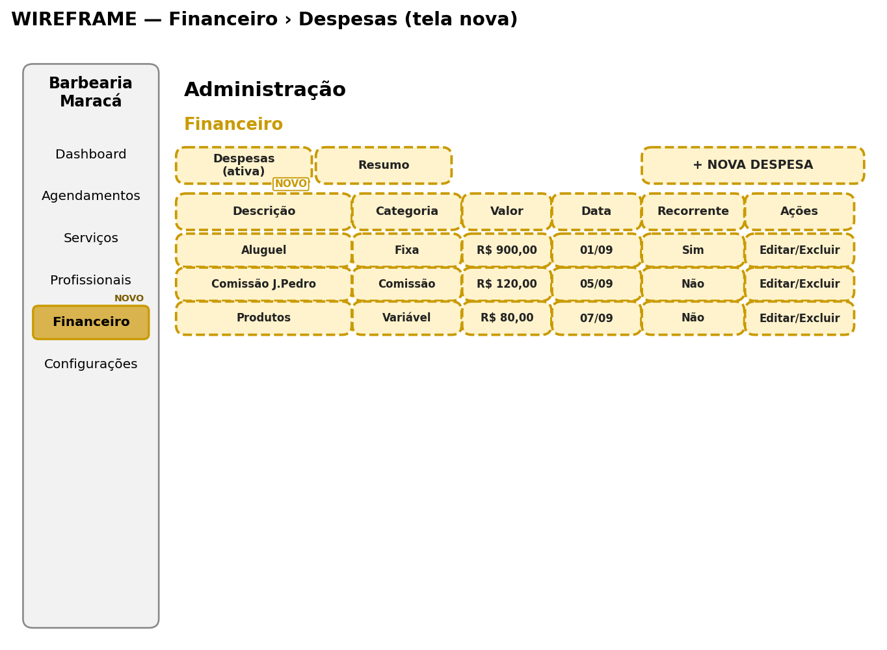
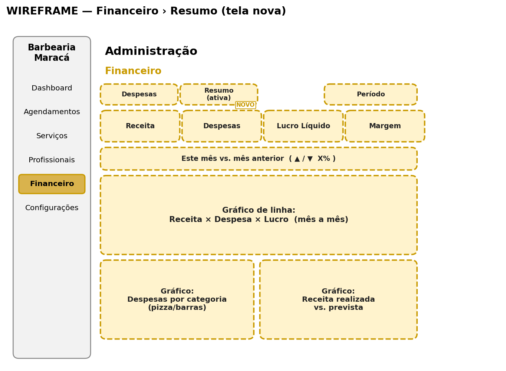
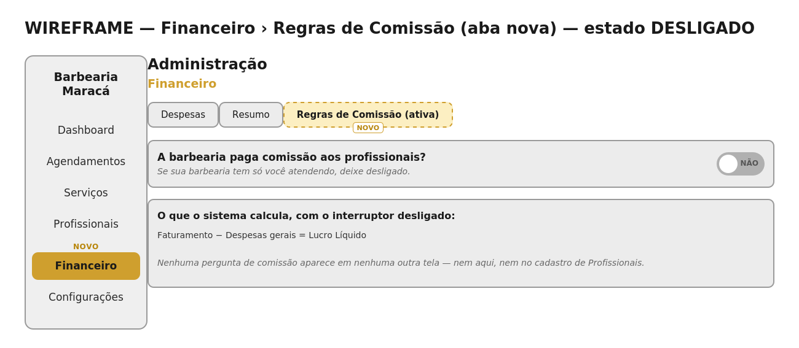
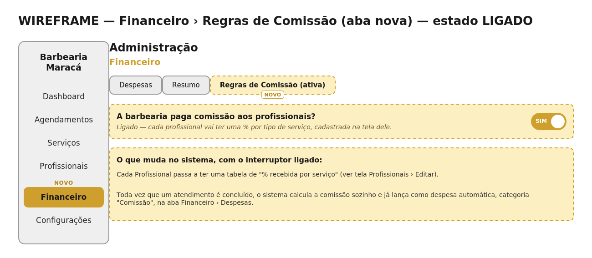
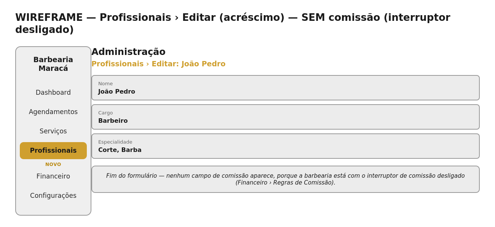
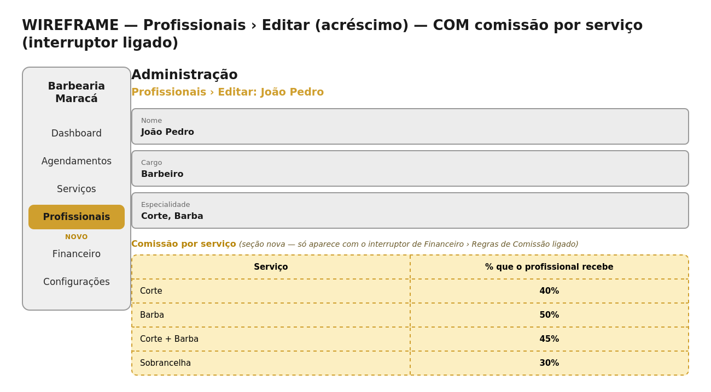

# Barbearia Maracá — Especificação de Telas — Painel Administrativo

Telas existentes + Módulo Financeiro (Despesas, Resumo e Regras de Comissão) — documento de referência (Rai / design), convertido para leitura por agente.

> **Nota desta versão:** a tela "Regras de Comissão" mudou de lugar em relação a
> versões anteriores: antes estava dentro de "Configurações", agora é a 3ª aba
> de "Financeiro" (Despesas | Resumo | Regras de Comissão).
> Motivo: "Financeiro" já é protegido pela permissão `ver_financeiro`
> ("Visualizar dados financeiros" — ver item 2.4), então a Regra de Comissão
> herda essa proteção automaticamente, sem precisar criar uma permissão nova.
> "Configurações" continua sendo só a conta do próprio usuário logado (nome,
> foto, senha, e-mail) — sem nenhuma mudança nela.

Este documento reúne, tela por tela, o que já existe hoje no painel
administrativo e o que precisa ser criado para o módulo Financeiro — despesas,
lucro líquido, gráficos — e para as Regras de Comissão, que definem se e como a
barbearia paga comissão aos profissionais. Cada tela nova vem com um wireframe
(esboço de estrutura) pra orientar o layout. Nos wireframes, caixa tracejada
dourada = NOVO; caixa cinza sólida = já existe hoje, sem mudança.

---

## 1. Estrutura geral (já existe, sem mudança)

Todas as telas do admin compartilham o mesmo layout base: um menu lateral fixo
à esquerda (logo no topo, itens de navegação, botão "Voltar ao site" no fim) e
uma área de conteúdo à direita, que muda conforme o item clicado no menu.

- **Menu lateral atual:** Dashboard, Agendamentos, Serviços, Profissionais, Configurações.
- **Menu lateral após a mudança:** Dashboard, Agendamentos, Serviços, Profissionais, **Financeiro (NOVO)**, Configurações.

## 2. Telas que já existem hoje

### 2.1 Dashboard
Acesso: item "Dashboard" no menu lateral (tela inicial do admin).

- Filtros: Período e Profissional (dropdowns)
- 4 caixas: Total, Confirmados, Pendentes, Cancelados (contagem de agendamentos)
- Caixa: Faturamento (R$)
- Caixa: Profissional destaque do mês (nome + qtd. de atendimentos concluídos)
- Lista: Serviços mais vendidos (nome do serviço + quantidade)

### 2.2 Agendamentos
Acesso: item "Agendamentos" no menu lateral.

- Tabela: Cliente, Profissional, Serviço, Data/Hora, Status (etiqueta colorida), Ações (Confirmar/Concluir/Cancelar conforme o status)
- Busca por cliente + filtro de status + filtro de período (data inicial/final)
- Botão "Novo Agendamento" — wizard em 4 passos: Cliente → Serviços → Profissional & Horário → Confirmação
- Botão "Configurar Agenda" — modal de horário de funcionamento, dias indisponíveis e abertura excepcional

### 2.3 Serviços
Acesso: item "Serviços" no menu lateral.

- Tabela: Nome do Serviço, Duração, Preço, Ações (Editar/Excluir)
- Botão "Novo Serviço" — formulário: Nome, Descrição, Duração (min), Preço (R$)

### 2.4 Profissionais
Acesso: item "Profissionais" no menu lateral.

- Cartões por funcionário: foto/iniciais, nome, cargo, agendamentos no mês, Editar/Excluir
- Botão "Adicionar Novo" — cadastro completo (nome, cargo, especialidade, categorias, e-mail/senha)
- Botão "Gerenciar Permissões" — matriz RBAC, incluindo a permissão `ver_financeiro` ("Visualizar dados financeiros" — já existe, reaproveitada no módulo novo)

> Acréscimo especificado neste documento: quando a barbearia tiver a comissão
> ligada (ver 3.4), a tela "Editar" de cada profissional ganha a seção
> "Comissão por serviço" — ver 3.5.

### 2.5 Configurações
Acesso: item "Configurações" no menu lateral.

- Formulário do próprio usuário logado: nome, foto, alterar senha, alterar e-mail de acesso

> Sem mudanças nesta versão — a tela continua sendo só a conta do usuário logado.

---

## 3. O que precisa ser criado — Módulo Financeiro e Regras de Comissão

Objetivo: mostrar não só o faturamento (receita), mas também as despesas e o
lucro líquido. Isso exige 1 mudança em tela existente (Dashboard), 3 telas
novas dentro do item novo "Financeiro" (Despesas, Resumo e Regras de
Comissão), e 1 acréscimo condicional na tela que já existe "Profissionais ›
Editar".

**Acesso restrito:** o item "Financeiro" — e as suas 3 abas, incluindo Regras
de Comissão — só aparece para quem tem a permissão `ver_financeiro`
("Visualizar dados financeiros", já existe, ver 2.4). Nenhuma permissão nova
precisa ser criada.

### 3.1 Dashboard — acréscimos

A tela de Dashboard continua existindo como está; só ganha itens novos,
mantendo o estilo visual atual.

| Item novo | Descrição |
|---|---|
| Caixa "Despesas" | Soma de todas as despesas lançadas no período filtrado, em R$. |
| Caixa "Lucro Líquido" | Faturamento − Despesas (já descontando comissão, se ligada — ver 3.4). Destaque maior que as outras caixas. Verde/dourado se positivo, vermelho se negativo. |
| Caixa "Margem" | Percentual do lucro sobre o faturamento (Lucro ÷ Faturamento × 100). |
| Gráfico: Distribuição por status | Donut — proporção de agendamentos por status (confirmado/pendente/concluído/cancelado). |
| Gráfico: Agendamentos por dia | Barras — quantidade de agendamentos por dia (últimos 7 ou 30 dias). |
| Gráfico: Horários de pico | Barras — em quais horários do dia mais se agenda. |
| Gráfico: Serviços mais vendidos | Substitui a lista de texto atual por um gráfico de barras horizontais. |

*Mapa de posição — Dashboard, linha por linha (cinza sólido = já existe, sem mudar de lugar | amarelo tracejado = novo, entra nesta posição)*

### 3.2 Financeiro › Despesas (tela nova)

Acesso: clicar em "Financeiro" no menu lateral (abre nesta sub-aba por padrão).
Estrutura visual: igual à tela de Serviços que já existe — reaproveitar o
padrão, não criar um estilo novo.

| Coluna / Elemento | Descrição |
|---|---|
| Descrição | Texto livre (ex: "Aluguel", "Comissão João Pedro") |
| Categoria | Etiqueta colorida: Fixa / Variável / Comissão / Outro |
| Valor | Valor em R$ |
| Data | Data do lançamento |
| Recorrente | Sim/Não — indica se repete todo mês |
| Ações | Editar / Excluir, por linha |
| Botão "+ Nova Despesa" | Abre formulário modal com os mesmos campos acima, para cadastro |

> As linhas de categoria "Comissão" são as que chegam sozinhas, geradas pela
> Tela 3.4 (Regras de Comissão) — o admin não precisa digitar nada quando a
> comissão é automática; só usa "+ Nova Despesa" pra lançamentos manuais
> (aluguel, produto, etc.).

*Wireframe — Financeiro › Despesas (toda a tela é nova; aba "Regras de Comissão" entra ao lado, ver 3.4)*

### 3.3 Financeiro › Resumo (tela nova)

Acesso: dentro de "Financeiro", segunda sub-aba ao lado de "Despesas".
Propósito: visão aprofundada do financeiro (o Dashboard mostra o resumo
rápido; esta tela é pra quem quer entender com mais detalhe).

| Elemento | Descrição |
|---|---|
| Filtro de Período | Mesmo padrão de filtro já usado em outras telas do admin |
| 4 cartões (KPIs) | Receita, Despesas, Lucro Líquido, Margem — mesmos números do Dashboard, com mais destaque aqui |
| Comparativo | "Este mês vs. mês anterior", com seta pra cima/baixo e percentual de variação |
| Gráfico de linha | Evolução de Receita × Despesa × Lucro, mês a mês (3 linhas no mesmo gráfico) |
| Gráfico: Despesas por categoria | Pizza ou barras — quanto foi gasto em cada categoria (Fixa, Variável, Comissão, Outro) |
| Gráfico: Receita realizada vs. prevista | Compara o que já foi efetivamente ganho (concluído) com o que ainda está "a caminho" (pendente/confirmado) |

*Wireframe — Financeiro › Resumo (toda a tela é nova; aba "Regras de Comissão" entra ao lado, ver 3.4)*

### 3.4 Financeiro › Regras de Comissão (tela nova)

Acesso: terceira sub-aba dentro de "Financeiro", ao lado de "Despesas" e
"Resumo" — visível só pra quem tem `ver_financeiro` (a mesma permissão das
outras duas abas).

**Contexto de negócio:** Faturamento não é a mesma coisa que lucro: uma parte
do que entra no caixa pode já "ter dono" — é a comissão do profissional que
fez o atendimento. Uma barbearia de uma pessoa só (o dono é o próprio
profissional) não paga comissão pra si mesma. Já uma barbearia com equipe
precisa calcular quanto cada profissional recebe, porque é dinheiro que
realmente sai do caixa. A solução é um único interruptor global.

| | Barbeiro pequeno (sozinho) | Salão grande (equipe) |
|---|---|---|
| Interruptor | Desligado | Ligado |
| Cálculo do lucro | Faturamento − Despesas gerais | Faturamento − Despesas gerais − Comissões |
| Tela de comissão em Profissionais | Não aparece | Aparece: tabela de % por serviço |
| Exemplo real (um dia) | Fatura R$ 205,00, gasta R$ 45,00 → sobra R$ 160,00, tudo dele | João Pedro: corte (R$45×40%) + barba (R$35×50%) = R$35,50 de comissão |

**Wireframe — estado DESLIGADO (barbeiro pequeno):**

**Wireframe — estado LIGADO (salão grande):**

### 3.5 Profissionais › Editar — Comissão por serviço (acréscimo)

Acesso: botão "Editar" no card de um profissional já cadastrado (tela que já
existe, ver 2.4). O que muda é só o final do formulário, e só quando a Tela
3.4 estiver ligada. Os campos que já existem (Nome, Cargo, Especialidade etc.)
continuam exatamente como estão hoje.

**Wireframe — SEM comissão (interruptor de 3.4 desligado):**

**Wireframe — COM comissão por serviço (interruptor de 3.4 ligado):**

*Tabela de exemplo (João Pedro, barbeiro):*

| Serviço | % que o profissional recebe |
|---|---|
| Corte | 40% |
| Barba | 50% |
| Corte + Barba | 45% |
| Sobrancelha | 30% |

> Esse valor vira despesa automática toda vez que o profissional concluir um
> atendimento daquele serviço — a comissão entra sozinha na tela Financeiro ›
> Despesas (3.2), categoria "Comissão", sem precisar de lançamento manual.

---

## 4. Mapa de navegação

- Dashboard (já existe, ganha 3 caixas novas)
- Agendamentos (já existe, sem mudança)
- Serviços (já existe, sem mudança)
- Profissionais (já existe — Editar ganha a seção "Comissão por serviço" quando a comissão estiver ligada)
- **Financeiro (NOVO)** — só aparece pra quem tem permissão `ver_financeiro` — com Despesas (tabela + formulário), Resumo (números + gráficos) e Regras de Comissão (interruptor geral)
- Configurações (já existe, sem mudança)

## 5. Resumo executivo (checklist rápido)

| Tela | Status |
|---|---|
| Dashboard (base atual) | Já existe |
| Dashboard (3 caixas financeiras + 4 gráficos) | A CRIAR |
| Agendamentos | Já existe — sem mudança |
| Serviços | Já existe — sem mudança |
| Profissionais (base atual) | Já existe — sem mudança |
| Profissionais › Editar (Comissão por serviço) | A CRIAR (acréscimo, condicional) |
| Financeiro › Despesas | A CRIAR |
| Financeiro › Resumo | A CRIAR |
| Financeiro › Regras de Comissão | A CRIAR |
| Configurações | Já existe — sem mudança |

**Observação de identidade visual:** todas as telas novas devem reaproveitar
as cores, bordas, tipografia e componentes já usados no restante do sistema
(tons escuros de fundo, dourado nos destaques e ações principais) — sem criar
um estilo visual à parte.
