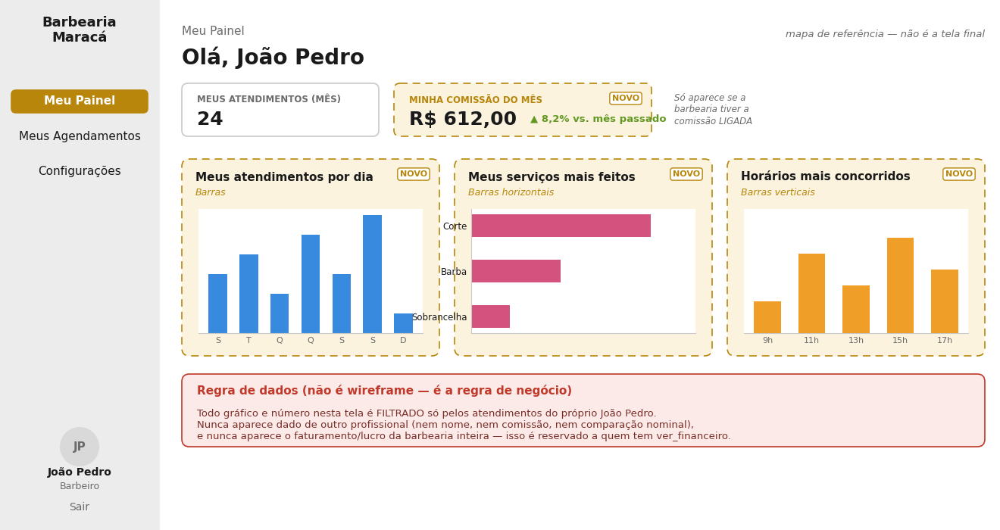

# Barbearia Maracá — Especificação de Tela — Painel do Barbeiro (Dashboard Pessoal)

> Documento complementar à Especificação de Telas — Painel Administrativo
> (`especificacao-financeiro-comissao.md`). Convertido para leitura por agente
> e por design (Rai).

## 1. Por que essa tela existe

O Painel Administrativo (documento principal) é feito para quem gerencia a
barbearia — dono, gestor, quem tem a permissão `ver_financeiro`. Mas o
profissional que atende (o barbeiro) também precisa de um espaço próprio: um
painel simples, só com os dados dele, que ajude ele a entender o próprio
desempenho — sem misturar com informação de gestão da empresa.

O padrão de mercado para esse tipo de painel (visto em apps como motorista de
aplicativo, entregador, ou qualquer prestador de serviço dentro de uma
plataforma maior) segue sempre a mesma lógica: só dados individuais, de
autoconhecimento, e sempre algo em que a pessoa consegue agir — nunca
estatística por estatística sem propósito.

## 2. Regra de dados — o que pode e o que não pode aparecer

**Regra de negócio (não é wireframe)**

Todo número e gráfico desta tela é filtrado **só pelos atendimentos do
próprio profissional logado**. Nunca aparece dado nominal de outro colega
(nem atendimentos, nem comissão, nem ranking comparativo), e nunca aparece o
faturamento ou lucro da barbearia inteira — isso é informação de gestão,
reservada a quem tem a permissão `ver_financeiro`.

Por que isso importa: misturar dado de colega gera comparação e clima ruim de
equipe. Misturar dado da empresa (faturamento total, lucro líquido) dá ao
barbeiro comum acesso a informação sensível de gestão que não é dele. As duas
coisas quebram o princípio do painel: ele é um espelho, mostra só o reflexo
da própria pessoa.

## 3. Wireframe — Meu Painel

> Wireframe de referência — layout ilustrativo, dados fictícios. Caixa
> tracejada dourada = novo (nada disso existe hoje).

## 4. Elementos da tela

| Elemento | Descrição | Condição de exibição |
|---|---|---|
| Meus atendimentos (mês) | Contagem de atendimentos concluídos pelo próprio profissional no mês corrente. | Sempre visível |
| Minha comissão do mês | Soma da comissão gerada para o próprio profissional no período, com comparação percentual vs. mês anterior (seta para cima/baixo). | Só se `comissao_ativa = true` (interruptor global ligado, ver seção 3.4 do documento principal) |
| Meus atendimentos por dia | Gráfico de barras — quantidade de atendimentos do próprio profissional, por dia, últimos 7 dias. | Sempre visível |
| Meus serviços mais feitos | Gráfico de barras horizontais — quais serviços o profissional mais realizou no período. | Sempre visível |
| Horários mais concorridos | Gráfico de barras verticais — em que horários do dia o próprio profissional mais atende. | Sempre visível |

## 5. Permissão — diferente do painel administrativo

Esta tela **NÃO** exige a permissão `ver_financeiro`. O motivo: `ver_financeiro`
protege a visão da saúde financeira da **EMPRESA** (faturamento total,
despesas, lucro líquido, margem — dados de gestão). Já "Minha comissão do
mês" é o dinheiro que o próprio profissional ganhou — informação pessoal
dele, não da empresa.

A regra de acesso aqui é simplesmente: **o profissional só vê os próprios
dados, sempre, independente de ter ou não `ver_financeiro`.**

## 6. Fora de escopo nesta versão (Fase 2)

- **Meta de produtividade por profissional** — registrado como ideia futura,
  mas precisa ser não-competitiva entre colegas (evitar gamificação que vire
  pressão disfarçada).
- **Aluguel de cadeira** (modelo alternativo de remuneração) — fora do
  escopo atual, o modelo vigente é comissão por serviço.
- **Desconto de fidelidade para clientes recorrentes** — não relacionado ao
  painel do barbeiro, mas registrado aqui para não se perder.

## 7. Checklist rápido

| Item | Status |
|---|---|
| Meus atendimentos (mês) | A CRIAR |
| Minha comissão do mês (condicional) | A CRIAR |
| Meus atendimentos por dia | A CRIAR |
| Meus serviços mais feitos | A CRIAR |
| Horários mais concorridos | A CRIAR |

**Observação de identidade visual:** reaproveitar as mesmas cores, bordas e
tipografia já usadas no restante do sistema — sem criar um estilo visual à
parte. Os gráficos reaproveitam a mesma lógica de agregação já construída
para o Dashboard administrativo (seção 3.1), apenas filtrando pelo
profissional logado.
